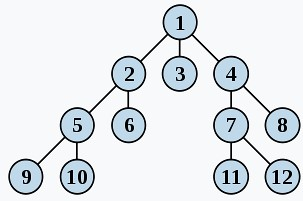
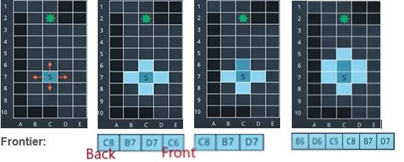
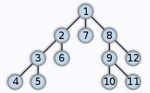
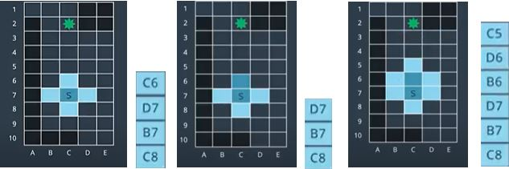

# Graph Search Breadth_First & Depth_First
Graph search is used to find a finite sequence of discrete actions to connect a start state to a goal state.  
It does so by searching. Visiting states sequentially and checking if state is the goal state. It goes through  
node by node until it see the goal node one node away.

## Breadth-First Search
  
Breadth-first search(BFS) is one of the simplest types of search, this algorithm searches a space broadly before it searches deeply.  
Figure above shows interconnected node the the start node athe top of the tree. Breadth-first search traverses the tree exploring at   
one level at a time. In a tree like this, it is usually implied that you search left first than right.

Breadth-first search is an uninformed search algorithm. This means that it searches blindly without any knowledge of the space it’s  
traversing or where the goal may be. For this reason, it isn’t the most efficient in its operation.

### Illustration:
Prequisite expansion sequence: Up Right Left Down

## Depth-First Search  
  
Deep-first search (DFS) is another uninformed search algorithm. It searches deep before it searches broadly.Instead of search level by level, DFS will explore the start   nodes first child and then that nodes first child and so on until it hits the lowest leaf in this branch.  
Comparing to BFS, DFS expands in an order of stack as shown in the figures below:

 